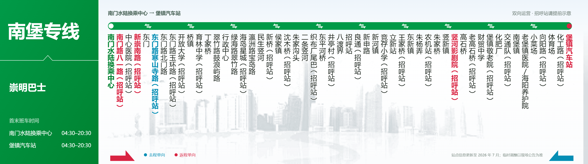
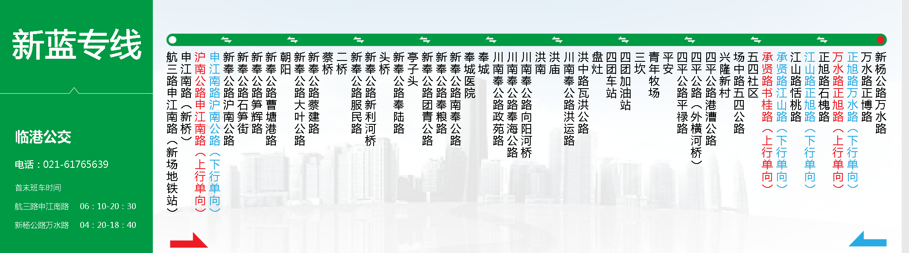

# 公交线路图制作器

一个无需安装、无需编程，下载后用浏览器打开就能使用的公交线路图制作工具。

填写线路名称、首末班时间和站点列表后，页面会实时生成预览，并可导出高清 PNG 图片。工具支持离线运行，适合制作线路示意图、站牌效果图和临时公告配图。

## 效果示例

### 南堡专线生成示例

这张图片由工具导出，展示了普通双向站、去程单向站、返程单向站以及较多站点时的排版效果。



[打开南堡专线原图](./examples/nanbao-route-example.png)

### 新蓝专线版式参考

这张图片用于展示另一条线路和不同站点密度下的版式效果。它是版式参考，当前工具的实际导出效果请以页面实时预览和上方生成示例为准。



[打开新蓝专线参考原图](./examples/xinlan-route-reference.png)

> 示例内容仅用于演示排版，实际运营信息请以公交运营单位公告为准。

## 最快上手

1. 下载本项目并解压。如果只想使用工具，也可以只保留 [公交线路图制作器.html](./公交线路图制作器.html)。
2. 双击打开 `公交线路图制作器.html`。如果系统询问打开方式，推荐选择最新版 Chrome 或 Edge。
3. 直接修改页面自带的“南堡专线”示例，或者点击“新建空白线路”从头开始。
4. 填写线路名称、运营单位、起终点和首末班时间。
5. 在“站点信息”中每行填写一个站名，并查看右侧实时预览。
6. 按需调整颜色、字体、站名字号和导出清晰度。
7. 点击“导出 PNG”保存成品。

工具会自动保存当前填写内容。下次使用同一个浏览器打开时，可以继续编辑。

## 站点怎么填写

每行填写一个站名。需要标记单向停靠时，把标记写在站名最前面：

```text
南门水陆换乘中心
[返]南门路八一路（招呼站）
中心医院（招呼站）
[去]东门路寒山寺路（招呼站）
堡镇汽车站
```

| 输入示例 | 工具如何处理 |
| --- | --- |
| `人民广场` | 双向停靠 |
| `[去]机场路口` | 仅去程停靠，使用去程单向色 |
| `[返]汽车站` | 仅返程停靠，使用返程单向色 |
| `1. 火车站` | 自动忽略编号，按双向站处理 |

中文全角方括号 `［去］`、`［返］` 也可以使用。

- 首行和末行会自动显示为起点、终点样式。
- 可以直接粘贴带有 `1.`、`1、` 等编号的站点列表。
- 最多显示 80 个站点。
- 修改基础信息中的起点、终点后，可点击“同步首末站”覆盖站点列表的首行和末行。
- “反转线路”会交换起终点和首末班时间，同时互换去程、返程单向标记。

## 调整颜色和字体

展开“样式与导出”后，可以分别设置线路名称、左侧信息、站名和说明文字的字体，还可以调整三种站点颜色与站名字号。

字体有三种选择方法：

1. 在字体输入框中搜索或直接填写字体名称。
2. 点击输入框右侧的“列表”，展开常用字体进行选择。
3. 点击“读取本机字体”，在授权后加载电脑中安装的完整字体列表。

“读取本机字体”不是必须操作。只有想从电脑的全部已安装字体中挑选时才需要使用；目前建议在桌面版 Chrome 或 Edge 中操作。即使读取失败，常用字体列表和手动输入仍然可以正常使用，字体名称也不会上传。

如果所填字体没有安装，浏览器会自动改用备用字体。导出成 PNG 后，文字已经成为图片的一部分，查看图片的人不需要安装相同字体。

## 导出图片

| 清晰度 | 图片尺寸 | 适合场景 |
| --- | --- | --- |
| 标准 | 1536 × 429 | 快速预览、聊天发送 |
| 高清（默认） | 3072 × 858 | 日常发布、一般打印 |
| 超清 | 4608 × 1287 | 大图展示、需要更多细节时 |

导出前需要填写线路名称，并至少填写两个站点。生成完成后，工具会尝试自动下载，也可以点击“保存 PNG”。手机没有自动保存时，可以长按导出结果并选择保存到相册。

如果手机或较旧的电脑导出超清图片失败，可以降低清晰度后重试。

每张导出图片都会在画面中显示联系邮箱，并在 PNG 图片信息中写入联系方式。部分聊天软件、社交平台、截图或格式转换操作可能会移除图片信息，但画面中可见的邮箱通常会保留。

## 常用功能

- 实时预览，并可放大查看、适应屏幕或全屏预览。
- 自动保存当前线路内容和样式。
- 一键同步首末站、反转线路、恢复南堡示例或清空站点。
- 可隐藏方向图例和右下角备注。
- 支持手机浏览器，手机底部提供“查看大图”和“一键导出 PNG”。
- 电话号码可以留空，线路上方说明和右下角备注可自由修改。

## 单 HTML 与隐私说明

工具的界面、代码和背景图都已经嵌入 `公交线路图制作器.html`：

- 不需要安装软件，也不需要启动服务器。
- 下载后无需联网即可运行。
- 单独复制这一个 HTML 文件到其他电脑也能使用。
- 仓库中的 `busback5.jpg` 只是原始背景图的资源备份，不是运行所需文件。
- 填写内容只保存在当前浏览器本地，工具不会主动上传线路、站点或字体数据。
- 自动保存不会改写 HTML 文件，也不会跨浏览器或跨设备同步。清理浏览器数据、使用隐私模式或更换电脑后，原来的编辑内容可能无法恢复。

完成制作后，建议及时导出 PNG 作为成品备份。

## 常见问题

### 打开后为什么还是上次填写的线路？

工具会自动恢复当前浏览器中保存的内容。需要重新开始时，点击“新建空白线路”；需要查看内置示例时，点击“恢复南堡示例”。这两项操作都会先显示确认提示。

### “读取本机字体”失败会影响使用吗？

不会。这个功能只是加载更完整的字体列表，不影响常用字体选择、编辑、预览和导出。

### 字体名称填写了，但效果没有变化怎么办？

请确认该字体已经安装在当前电脑中。未安装的字体会自动使用备用字体显示。

### 站点太多，文字显得拥挤怎么办？

可以适当缩小“站名字号”、缩短过长的站名，或者换用更紧凑的字体。工具最多支持 80 个站点。

### 点击导出没有生成图片怎么办？

先确认线路名称不为空，并且至少填写了两个站点。仍然失败时，建议改用最新版 Chrome 或 Edge，或者降低导出清晰度后重试。

### 手机上能使用吗？

可以。页面已适配手机浏览器；如果图片没有自动下载，可长按导出结果保存。

### 背景图需要单独放在 HTML 旁边吗？

不需要。背景图已经嵌入 HTML，`busback5.jpg` 仅作为原始资源备份。

## 项目文件

| 文件 | 用途 |
| --- | --- |
| `公交线路图制作器.html` | 可独立运行的完整工具 |
| `busback5.jpg` | 内嵌背景图的原始资源备份 |
| `examples/nanbao-route-example.png` | 南堡专线生成示例 |
| `examples/xinlan-route-reference.png` | 新蓝专线版式参考 |

## 联系方式

如有问题或建议，请联系 [zh.junbai@icloud.com](mailto:zh.junbai@icloud.com)。
